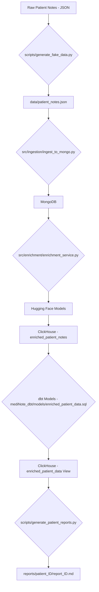

# mediNote

```
 __  __          _ _ _   _       _       
|  \/  | ___  __| (_) \ | | ___ | |_ ___ 
| |\/| |/ _ \/ _` | |  \| |/ _ \| __/ _ \
| |  | |  __/ (_| | | |\  | (_) | ||  __/
|_|  |_|\___|\__,_|_|_| \_|\___/ \__\___|
                                         
```

A cutting-edge data engineering project designed to showcase a robust, full-stack workflow for processing and analyzing unstructured healthcare data. We're transforming raw, "anarchic" patient notes into structured, actionable insights.

## 🚀 Key Objectives

-   **Ingest:** Seamlessly process simulated unstructured patient notes (free-text) into our data lake.
-   **Enrich:** Leverage state-of-the-art Hugging Face AI models for advanced Named Entity Recognition (NER) and intelligent summarization, extracting critical clinical information.
-   **Store:** Persist raw, original data in MongoDB (our flexible NoSQL document store) and store the structured, enriched data in ClickHouse (our blazing-fast analytical column-store).
-   **Model:** Utilize dbt (Data Build Tool) for powerful data modeling, transformation, and quality assurance, ensuring data integrity and analytical readiness.
-   **Report:** Generate structured, human-readable reports for each patient, consolidating all extracted and enriched information.

## 🛠️ Core Technologies

-   **Data Ingestion:** Python scripts (for direct loading into MongoDB)
-   **AI Integration:** Hugging Face Transformers (for NER and Summarization)
    -   **NER Model:** `blaze999/Medical-NER` (for comprehensive medical entity extraction)
    -   **Summarization Model:** `sshleifer/distilbart-cnn-6-6`
-   **Data Storage:**
    -   MongoDB (Unstructured Data Lake)
    -   ClickHouse (Structured/Analytical Data Warehouse)
-   **Data Transformation:** dbt, SQL
-   **Orchestration:** Python
-   **Containerization:** Docker, Docker Compose

## 📈 Project Workflow (The Data Journey)



## 🚀 Getting Started

### Prerequisites

-   Python 3.9+
-   Docker & Docker Compose
-   dbt Core

### Installation

1.  **Clone the repository:**
    ```bash
    git clone https://github.com/spideystreet/mediNote.git
    cd mediNote
    ```

2.  **Set up Python environment:**
    ```bash
    python -m venv venv
    source venv/bin/activate
    pip install -r requirements.txt
    ```

3.  **Start data services (MongoDB & ClickHouse):**
    ```bash
    docker-compose up -d
    ```
    *Ensure your `.env` file is configured with `MONGO_PORT`, `CLICKHOUSE_USER`, `CLICKHOUSE_PASSWORD`, and `CLICKHOUSE_PORT`.*

4.  **Configure dbt:**
    Create a `profiles.yml` file in your `~/.dbt/` directory (or wherever dbt expects it) with the following ClickHouse profile:

    ```yaml
    medinote:
      target: dev
      outputs:
        dev:
          type: clickhouse
          host: localhost
          port: 8123
          user: default
          password: "password" # Use your CLICKHOUSE_PASSWORD from .env
          database: default
          schema: default
          secure: False
          retries: 3
    ```
    *Verify your dbt setup:*
    ```bash
    cd mediNote_dbt
    dbt debug
    cd ..
    ```

## ⚡ Usage (The Pipeline in Action)

Follow these steps to run the full data engineering pipeline:

1.  **Generate Anarchic Patient Data:**
    ```bash
    ./venv/bin/python3 scripts/generate_fake_data.py
    ```
    *This populates `data/patient_notes.json` with diverse, simulated patient records.*

2.  **Ingest Data to MongoDB:**
    ```bash
    ./venv/bin/python3 src/ingestion/ingest_to_mongo.py
    ```
    *This script reads `patient_notes.json` and loads it into the `medinote_db.patient_notes` collection in MongoDB.*

3.  **Enrich Data with AI (Hugging Face):**
    ```bash
    ./venv/bin/python3 src/enrichment/enrichment_service.py
    ```
    *This is where the magic happens! The script pulls data from MongoDB, uses `blaze999/Medical-NER` for entity recognition and `sshleifer/distilbart-cnn-6-6` for summarization, then stores the enriched data in ClickHouse's `enriched_patient_notes` table.*

4.  **Run dbt Models & Tests:**
    ```bash
    cd mediNote_dbt
    dbt run
    dbt test
    cd ..
    ```
    *`dbt run` transforms the `enriched_patient_notes` table into the `enriched_patient_data` view (or table, depending on materialization) in ClickHouse, extracting key entities. `dbt test` ensures data quality.*

5.  **Generate Patient Reports:**
    ```bash
    ./venv/bin/python3 scripts/generate_patient_reports.py
    ```
    *This script connects to ClickHouse, fetches the processed data, and generates structured Markdown reports for each patient in the `reports/` directory. These reports provide a clear, human-readable summary of the original note, AI-generated summary, and all extracted medical entities.*

## 🔍 Verifying Data in ClickHouse

You can directly query your ClickHouse database via the CLI to inspect the transformed data:

```bash
docker exec medinote-clickhouse clickhouse-client -u default --password 'password' --query "SELECT patient_id, summary, first_entity_group, first_entity_word, ner_entities FROM default.enriched_patient_data LIMIT 5;"
```
*(Replace `'password'` with your `CLICKHOUSE_PASSWORD` from `.env` if different.)*

---
*This project is for training and demonstration purposes. Data is simulated and models are for illustrative purposes only.